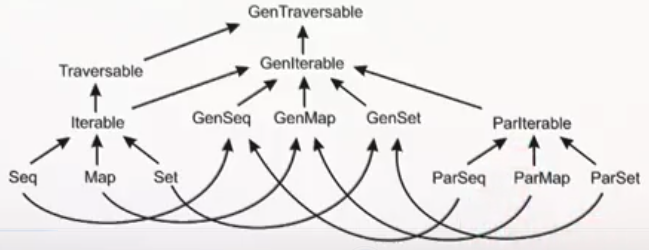

- [Introduction](#introduction)
- [Threads](#threads)
- [Atomicity, Synchronization, Deadlock](#atomicity-synchronization-deadlock)
- [Parallel Algorithms](#parallel-algorithms)
- [Runtimes](#runtimes)
- [Benchmarking](#benchmarking)
- Implementation
    - [Copy](#copy-implementation)
    - [Map](#map-implementation)
    - [Reduce](#reduce-implementation)
- [Data-Parallel Programming](#data-parallel-programming)
- [Scala Collections](#scala-collections)
- [Splitters and Combiners](#splitters-and-combiners)
- [Parallel Two-Phase Construction](#parallel-two-phase-construction)
- [References](#references)

## Introduction

__Parallel computing__ is a type of computation in which many calculations are performed at the same time.

__CPU speed-up is non-linear__ - The power required to speed up a CPU starts to grow non-linearly. For this reason, we add more CPUs instead of trying to speed up just 1 CPU.

## Threads

__Thread memory address space__ - Threads can be started from within the same program, and they share the same memory.

Example using threads:

```scala
class HelloThread extends Thread {
  override def run() {
    println("Hello world!")
  }
}

val t = new HelloThread

t.start()
t.join()
```

Calling `t.join()` will block execution on the main thread until `HelloThread` completes

## Atomicity, Synchronization, Deadlock

Atomicity - An operation is _atomic_ if it appears as if it occurred instantaneously from the point of view of other threads.

the `synchronized` keyword is used to acheive atomicity.

Example of deadlock with 2 synchronized threads:

```scala
class Account(private var amount: Int = 0) {
  def transfer(target: Account, n: Int) =
    this.synchronized {
      target.synchronized {
        this.amount -= n
        target.amount += n
      }
    }
  }  
}
```

```scala
def startThread(a: Account, b: Account, n: Int) = {
  val t = new Thread {
    override def run() {
      for (i <- 0 until n) {
        a.transfer(b, 1)
      }
    }
  }
  t.start()
  t
}
```

```scala
val a1 = new Account(500000)
val a2 = new Account(700000)

val t = startThread(a1, a2, 150000)
val s = startThread(a2, a1, 150000)
t.join()
s.join()
```
Deadlock occurred since the Account `a1` is waiting for Account `a2` to release the lock, and Account `a2` is waiting for Account `a1` to release the lock.

This deadlock can be fixed by ensuring a lock is grabbed for the smaller account number before the larger account number.

```scala
class Account(private var amount: Int = 0) {
  val uid = getUniqueUid()
  private def lockAndTransfer(target: Account, n: Int) =
    this.synchronized {
      target.synchronized {
        this.amount -= n
        target.amount += n
      }
    }

  def transfer(target: Account, n: Int) =
    if (this.uid < target.uid) this.lockAndTransfer(target, n)
    else target.lockAndTransfer(this, -n)
}
```

## Parallel Algorithms

The `parallel` keyword will parallelize 2 calls. It is defined as:

```scala
def parallel[A, B](taskA: => A, taskB: => B): (A, B) = { ... }
```

Scala "by-name" parameters `=>` are used to achieve lazy evaluation of `A` and `B`, so that they can be evaluated in parallel instead of when the function is initially called.

Here is a recursive algorithm for an unbounded number of threads. It calculates the _p-norm_ for a 2-D vector:

```scala
def pNormRec(a: Array[Int], p: Double): Int =
  power(segmentRec(a, p, 0, a.length), 1/p)

def segmentRec(a: Array[Int], p: Double, s: Int, t: Int) = {
  if (t - s < threshold) {
    sumSegment(a, p, s, t) // small segment: do it sequentially
  } else {
    val m = (s + t) / 2
    val (sum1, sum2) = parallel(segmentRec(a, p, s, m), segmentRec(a, p, m, t))
    sum1 + sum2
  }
}
```

Here is an example of 4 threads in parallel:

```scala
val ((part1, part2), (part3, part4)) =
  parallel(parallel(sumSegment(a, p, 0, mid1),
                    sumSegment(a, p, mid1, mid2)),
           parallel(sumSegment(a, p, mid2, mid3),
                    sumSegment(a, p, mid3, a.length)))
power(part1 + part2 + part3 + part4, 1/p)
```

## Runtimes

If we sum all integers in an array of length `n`, our runtime is `O(n)` if it's done sequentially.

Assuming enough CPUs are available for full parallelization, then the code takes "tree" form where the runtime is the same as the height of the tree: O(log(n))

```
                      sum(0 to 8)
      sum(0 to 4)                   sum(5 to 8)           // both done in parallel
sum(0 to 2)  sum(3 to 4)      sum(5 to 6)  sum(7 to 8)    // all 4 done in parallel
```

If we didn't have enough CPUs for full parallelization, the runtime would be O(n)

## Benchmarking

A naive approach for benchmarking is to do:

```scala
val xs = List(1, 2, 3)
val startTime = System.nanoTime
xs.reverse
println((System.nanoTime - startTime) / 1000000)
```

The above method can be improved by
- doing Multiple repetitions
- statistical treatment - computing mean and variance
- Eliminating outliers
- Ensuring steady state (warm-up). This can be achieved by using a tool called _ScalaMeter_
- Preventing anomalies (Garbage Collection, Just-in-time compilation)

## Copy: Implementation

```scala
def copy(src: Array[Int], target: Array[Int], from: Int, until: Int, depth: Int): Unit = {
  if (depth == maxDepth) {
    Array.copy(src, from, target, from, until - from)
  } else {
    val mid = (from + until) / 2
    val right = parallel(
      copy(src, target, mid, until, depth + 1),
      copy(src, target, from, mid, depth + 1)
    )
  }
}
```

## Map: Implementation

- __List__: Not good for parallel implementations because
    - difficult to split them in half (need to search for the middle)
    - concatenation lists takes linear time
- __Arrays__ and __trees__ work well.

#### Sequential Map

```scala
def mapASegSeq[A, B](inp: Array[A], left: Int, right: Int, f : A => B,
                     out: Array[B]) = {
  var i = left
  while (i < right) {
    out(i) = f(inp(i))
    i = i + 1
  }
}
```

Testing it gives:

```scala
// Input
val in = Array(2, 3, 4, 5, 6)
val out = Array(0, 0, 0, 0, 0)
val f = (x: Int) => x * x
mapASegSeq(in, 1, 3, f, out)
out

// Output
res1: Array[Int] = Array(0, 9, 16, 0, 0)
```

#### Parallel Map

- The base case is a sequential map.
- The recursive case is a parallel recursive map

```scala
def mapASegSeq[A, B](inp: Array[A], left: Int, right: Int, f : A => B,
                     out: Array[B]) = {
  if (right - left < threshold) {
    mapASegSeq(inp, left, right, f, out)
  } else {
    val mid = (left + right) / 2
    parallel(mapASegPar(inp, left, mid, f, out),
             mapASegPar(inp, mid, right, f, out))
  }
}
```

#### Parallel Map on Tree

- The base case is a sequential map.
- The recursive case is a parallel recursive map

```scala
def mapTreePar[A:Manifest, B:Manifest](t: Tree[A], f: A => B) : Tree[B] =
  t match {
    case Leaf(a) => {
      val len = a.length;
      val b = new Array[B](len)
      var i = 0;
      while (i < len) {
        b(i) = f(a(i))
        i = i + 1
      }
      Leaf(b)
    }
    case Node(l, r) => {
      val (lb, rb) = parallel(mapTreePar(l, f), mapTreePar(r, f))
      Node(lb, rb)
    }
  }
```

## Reduce: Implementation

Subtraction is not associative, so the following results are different:

```scala
List(1, 3, 8).foldLeft(100)((s, x) => s - x) == ((100 - 1) - 3) - 8 == 88
List(1, 3, 8).foldRight(100)((s, x) => s - x) == 1 - (3 - (8 - 100)) == -94
List(1, 3, 8).reduceLeft(100)((s, x) => s - x) == (1 - 3) - 8 == -10
List(1, 3, 8).reduceRight(100)((s, x) => s - x) == 1 - (3 - 8) == 6
```

#### Sequential Reduce on Tree

```scala
def reduce[A](t: Tree[A], f : (A, A) => A): A = t match {
  case Leaf(v) => v
  case Node(l, r) => f(reduce[A](l, f), reduce[A](r, f))
}
```

#### Parallel Reduce on Tree

```scala
def reduce[A](t: Tree[A], f : (A, A) => A): A = t match {
  case Leaf(v) => v
  case Node(l, r) =>} {
    val (lV, rV) = parallel(reduce[A](l, f), reduce[A](r, f))
    f(lV, rV)
  }
}
```

#### Parallal Reduce on Array

```scala
def reduceSeg[A](inp: Array[A], left: Int, right: Int, f: (A, A) => A): A = {
  if (right - left < threshold) {
    var res = inp(left)
    var i = left + 1
    while (i < right) {
      res = f(res, inp(i))
      i = i + 1
      res
    }
  } else {
    val mid = (left + right) / 2
    val (a1, a2) = parallel(reduceSeg(inp, left, mid, f),
                            reduceSeg(inp, mid, right, f))
    f(a1, a2)
  }
}

def reduce[A](inp: Array[A], f: (A, A) => A): A =
  reduceSeg(inp, 0, inp.length, f)
```

## Data-Parallel Programming

We use the `.par` function to convert a range to a parallel range. Iterations of the parallel loop will be executed on different processers. A parallel `for` loop does not return a value. It can only interact with the rest of the program by performing a side effect, such as writing to an array. This is only correct if iterations of the `for` loop write to separate memory locations, or use some form of synchronization.

The following code is correct:

```scala
def initializeArray(xs: Array[Int])(v: Int): Unit = {
  for (i <- (o until xs.length).par) {
    xs(i) = v
  }
}
```
But if we had changed `xs(i) = v` to `xs(0) = i`, the code would be incorrect since we would be trying to access the same entry in an array in multiple iterations of the `for` loop.

Scala collections can be converted to parallel collections by invoking the `.par` method:

```scala
(1 until 1000).par
  .filter(n => n % 3 == 0)
  .count(n => n.toString == n.toString.reverse)
```

Implementation of `sum` in parallel:

```scala
def sum(xs: Array[int]) : Int = {
  xs.par.fold(0)(_ + _)
}
```

Implementation of `max` in parallel:

```scala
def max(xs: Array[Int]): Int = {
  xs.par.fold(Int.MinValue)(math.max) // or rewrite math.max as: (x, y) => if (x > y) x else y
}
```

For the previous 2 examples, `fold` worked out for us since the functions we provided (`+` and `math.max`) were associative. The benefit of `fold` (as compared to `foldLeft` or `foldRight`) is that `fold` can run in parallel.


#### Counting Vowels

To count vowels in an array, we use the `aggregate` function:

```scala
def aggregate[B](z: B)(f: (B, A) => B, g: (B, B) => B): B
```

```scala
Array('E', 'P', 'F', 'L').par.aggregate(0)(
  (count, c) => if (isVowel(c)) count + 1 else count,
  _ + _
)
```

Each processor will use `f: (B, A) => B` to do it's calucation. The resulting calculations from the processors are combined using `g: (B, B) => B`. `aggregate` is a very general operation.


## Scala Collections



#### Scala Collections Hierarchy

- `Traversable[T]` - collection of elements with type `T`, with operations implemented using `foreach`
- `Iterable[T]` - collection of elements with type `T`, with operations implemented using `iterator`. Subtype of `Traversable[T]`, containing more collection methods.
- `Seq[T]` - An ordered sequence of elements with type `T`, where every element is assigned to an index. Subtype of `Iterable[T]`
- `Set[T]` - A set of elements with type `T` (no duplicates)
- `Map[K, V]` - a map of keys with type `K` associated with values of type `V` (no duplicate keys)

#### Parallel Collections

- `ParIterable[T]`, `ParSeq[T]`, `ParSet[T]`, `ParMap[K, V]`,
- `ParArray[T]` - parallel array of objects, counterpart of `Array` and `ArrayBuffer`
- `ParRange` - parallel range of integers, `counterpart of Range`
- `ParVector[T]` - parallel vector, counterpart of immutable `Vector`
- `immutable.ParHashSet[T]` - counterpart of `immutable.HashSet`
- `immutable.ParHashMap[T]` - counterpart of `immutable.HashMap`
- `mutable.ParHashSet[T]` - counterpart of `mutable.HashSet`
- `mutable.ParHashMap[T]` - counterpart of `mutable.HashMap`
- `ParTrieMap[K, V]` - thread-safe parallel map with atomic snapshots, counterpart of `TrieMap`

#### Generic Collections

These are collections that can have code that can be executed either in sequential or parallel: `GenIteratble[T]`, `GenSeq[T]`, `GenSet[T]`, `GenMap[K, V]`

`15251` is a sample palindrome. `largestPalindrome` searches for the largest palindrome in a sequence:

```scala
def largestPalindrome(xs: GenSeq[Int]): Int = {
  xs.aggregate(Int.MinValue) (
  	(largest, n) =>
  	if (n > largest && n.toString == n.toString.reverse) n else largest,
  	math.max
  )
}
val array = (0 until 1000000).toArray

largestPalindrome(array) // invoke sequentially
largestPalindrome(array.par) // invoke parallelly
```

#### Accessing same memory locations

Rule: Avoid mutations to the same memory locations without proper synchronization

The following code won't since using `+=` on `mutable.Set[Int]` may modify the memory locations.

```scala
def intersection(a: GenSet[Int], b: GenSet[Int]): Set[Int] = {
  val result = mutable.Set[Int]()
  for (x <- a) if (b contains x) result += x
  result
}
intersection((0 until 1000).toSet, (0 until 1000 by 4).toSet)
intersection((0 until 1000).par.toSet, (0 until 1000 by 4).par.toSet)
```

The program can be fixed by replacing `mutable.Set[Int]` with Java's `new ConcurrentSkipListSet[Int]()`

A smarter way to solve the problem is to recode the method to use `filter` instead of creating a new `Set`

```scala
def intersection(a: GenSet[Int], b: GenSet[Int]): GenSet[Int] = {
  if (a.size < b.size) a.filter(b(_))
  else b.filter(a(_))
}
```

Another Rule: Never modify a parallel collection on which a data-parallel operation is in progress


## Splitters and Combiners

#### Splitter

A splitter can be split into more splitters that traverse over disjoint subsets of elements.

```scala
trait Splitter[A] extends Iterator[A] {
	def split: Seq[Splitter[A]]
	def remaining: Int
}
```
Every parallel collection has its own `Splitter` implementation. Splitting is done multiple times during execution of a parallel operation, so it should be `O(log n)` or better runtime for us to benefit from parallelization.

#### Combiner

```scala
trait Combiner[A, Repr] extends Builder[A, Repr] {
  def combine(that: Combiner[A, Repr]): Combiner[A, Repr]
}
```

- combines 2 combiner objects into 1 combiner
- Should be `O(log n + log m)` or better runtime
- When collection is a set or map, combine represents a _union_
- When collection is a sequence, combine represents _concatenation_

## Parallel Two-Phase Construction

Let us discuss two-phase construction for arrays.

#### Combiner: Requirements

Achieving faster than `O(n)` runtime is not possible for `combine` if we use a standard array.

In Two-Phase construction, the combiner has an intermediate data structure as its internal representation

1. For `+=`, the intermediate data structure should have an efficient runtime
1. For `combine`, the intermediate data structure should have O(log n + log m) or better runtime
1. For intermediate data structure, it must be possible to convert to the resulting data structure in O(n/P) time. That is, the conversion must be parallelizable

#### Combiner: Implementation

Here is my mediocre explanation of the process:

Let `P` be the number of processors. Use an array of `P` arrays. Think of it as an array of pointers to arrays.

1. `+=` is O(1) amortized time to add 1 element to the end of 1 of the nested arrays.
1. `combine` is O(P) runtime to copy references to arrays, instead of copying arrays.
1. Converting to the resulting data structure can be done in parallel in O(n/P) time since we are writing to `n/P` different parts of the array in parallel.

## References

[Coursera: Parallel programming](https://www.coursera.org/learn/parprog1?specialization=scala) - Notes are based on this tutorial.

- Week 1 - Good videos
- Week 2 - Videos 1-3 were good. Videos 4-5 were too mathematical. Video 6: `scan` example was too advanced for this tutorial.
- Week 3 - Good videos
- Week 4 - Videos 1-2 were good. Videos 3-5: Conc-trees were too advanced for this tutorial.
